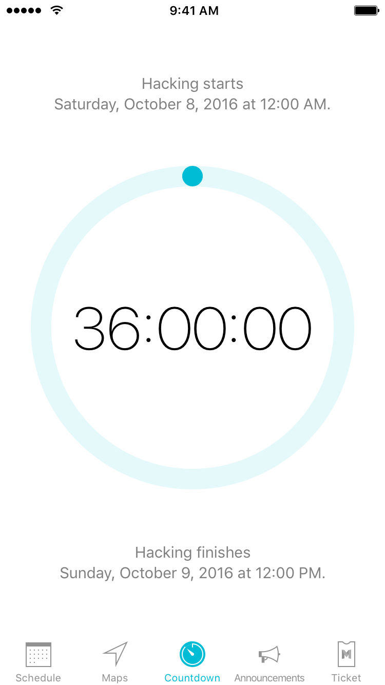
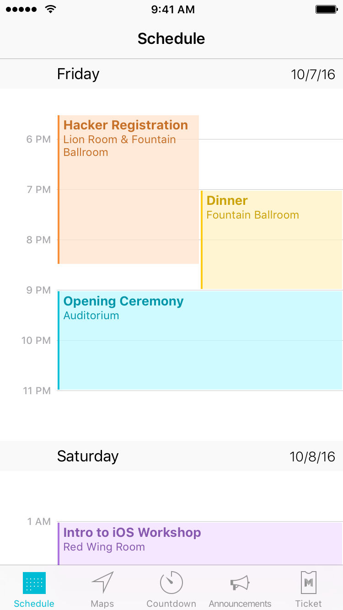
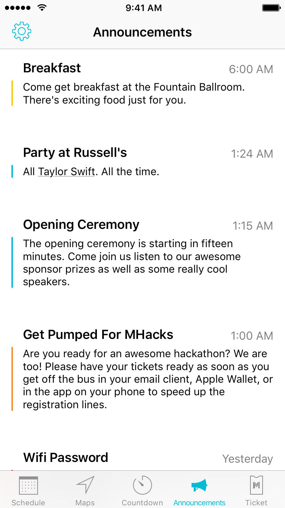
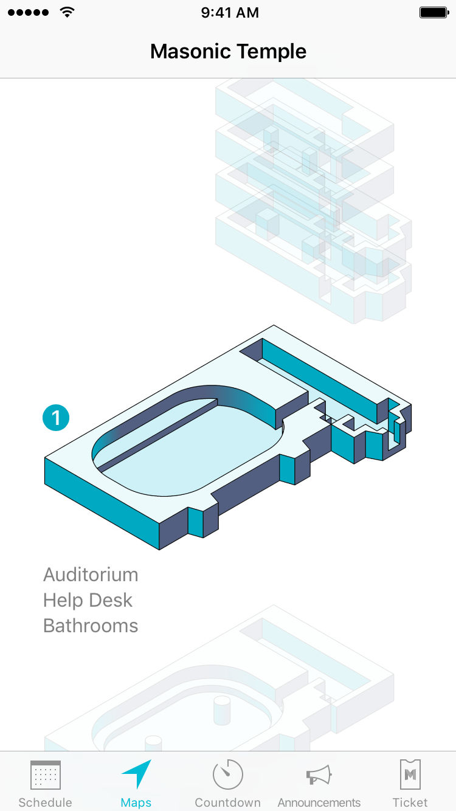
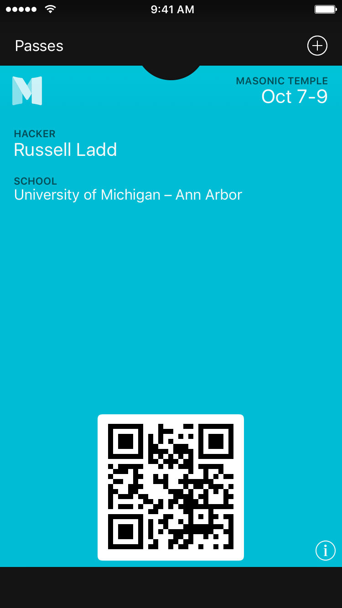
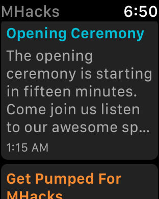
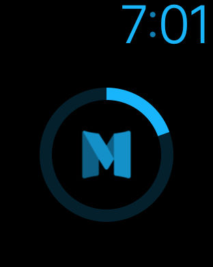

MHacks for iOS and  Watch
==============

This is the public repo for the MHacks iOS app. If you're developing an app for a hackathon at your school, feel free to take inspiration from ours. Please credit us if you copy pieces of our source code.

